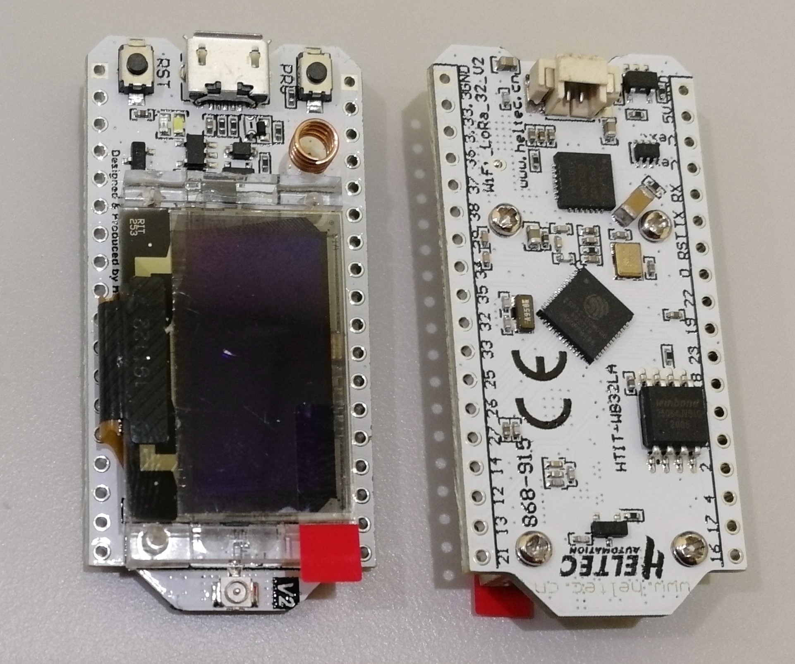
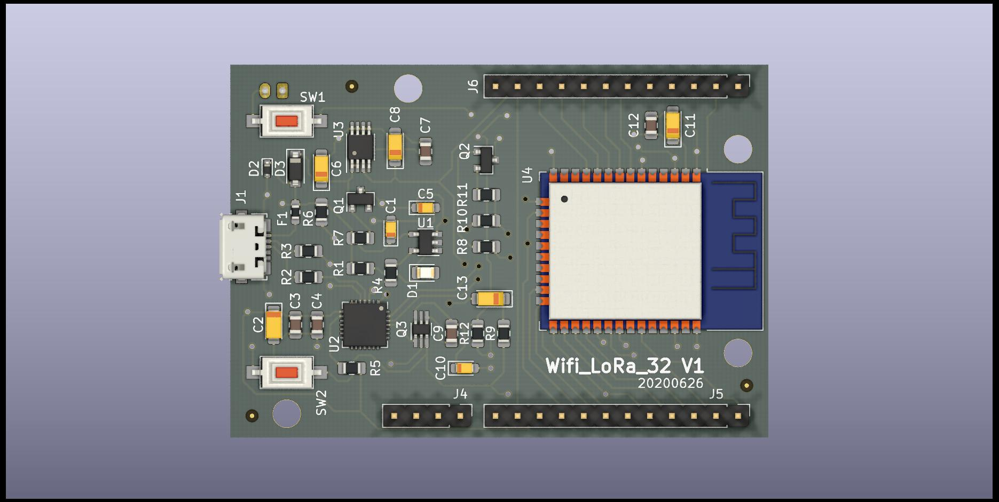
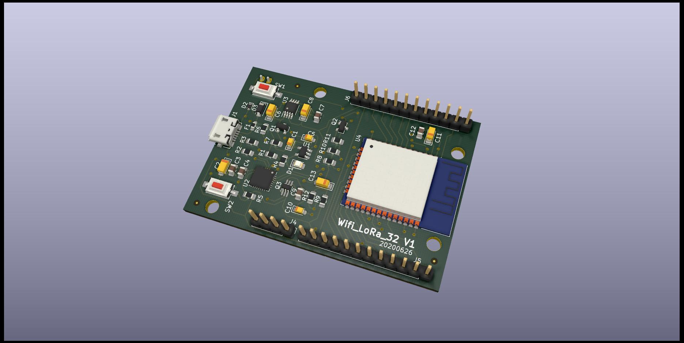
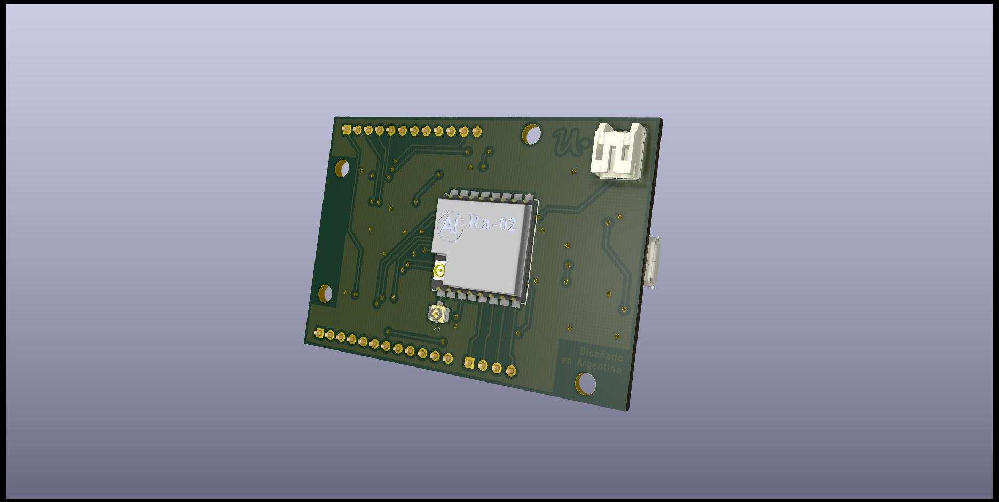

# TP final de la materia Diseño de Circuitos Impresos - CESE - 2020A
## Réplica  modificada Heltec Wifi LoRA V2

Propuesta general: Eliminar el display OLED y reemplazar los circuitos integrados ESP32 y SX1278 por los módulos ESP32-WROOM y Ra-01.

## Resultado

